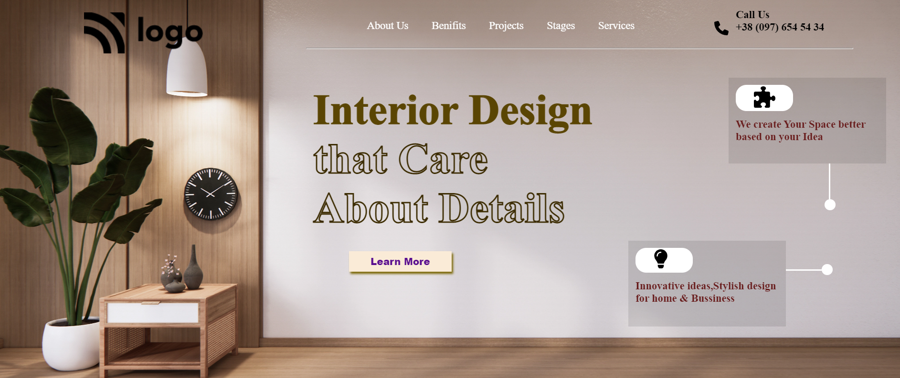

# Project10(HTML & CSS)

# Learnings from this project:

- Gained indepth knowledge about writing proper html code.

- Gained indepth knowledge on CSS Position Properties. 

## Time taken: 3 hours

# Web Page : [Live-Link](https://project10-htmlcss.netlify.app/)

